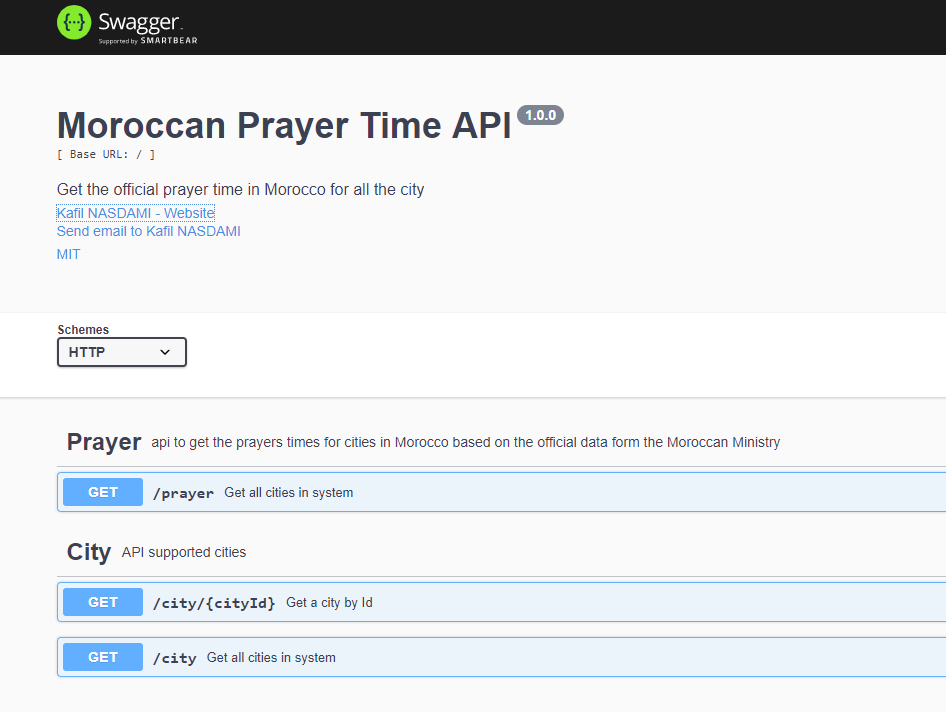

# [Salat API](https://maroc-salat.herokuapp.com/)

A simple public rest api to get the prayers times for cities in Morocco based on the official data form the [Moroccan Ministry](http://www.habous.gov.ma/)

## Desciption

This is a small nodejs/express server that fetches data from a mongodb database.

## Data Source

The source of the data is the official website of the [Moroccan Ministry](http://www.habous.gov.ma/), the code
behind the scrapping process in available in [this github repo](https://github.com/Kafiil/habous-scraper), the result is saved to a json file and then imported to a monogo database.

## Links

- The api is freely hosted on heroku [here](https://maroc-salat.herokuapp.com/) and there is a swagger ui to
  document and test the API.

- I Also made a small-really-ugly-just-working react application to consume this API:
  - [Demo](https://kafiil.github.io/salat/)
  - [Source code](https://github.com/Kafiil/salat)

## Coming soon (Stay tuned)

- A mobile application

- A google chrome extension

## Road map

- [x] Add Validation for all inputs
- [x] Add Swagger
- [ ] Add the optiion to return times as Datetime instead of strings (Loading ...)
- [ ] Add docker support ( Coming soon)

## Contribution

If you think this piece of code is anyhow useful, please feel free to contribute, star ⭐️⭐️ and share 🙏 🙏

### How to to help you asked ? 🙏

- Fork
- Star and share the project so it reaches more people
- Test and give your feedback
- Correct the data
- Provide translations
- Help with the documentation
- Help with UI/UX for the react app and the chrome extension

## License

This project is under the MIT license.

Made With ❤️ in Ramadan